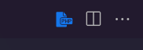
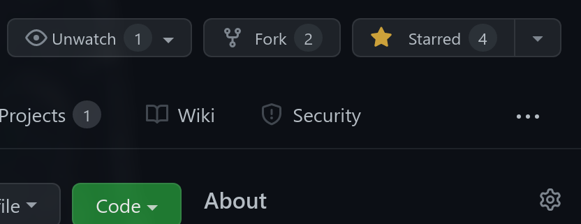

# [Skwal.net](https://skwal.net)

🌐 Source code of [Skwal.net](https://skwal.net) 

# Structure🏗️

## Importing css and js files

To import css and js files, please use the `css()` and `js()` php functions.

You have to use these function to prevent the browser from caching the files.

exemple :

```php
# Importing css files
css('style', 'global', 'mycss');

# Importing js files
js('script', 'global', 'myjs');
```

Do **not** forget to add the `.css` or `.js` extension to the files.

# Setting up development environment

For this project, I recommend Visual Studio Code.

Warning : You should **only** open the `📂 src/` folder if you want to edit the source code *of the website* (not the source code of the project, readme etc) 

You'll need to install the php server extension

```
ext install brapifra.phpserver
```

and click on the php icon in the top right corner of the editor to start a local server.



# Contributing

Before contributing, you should have basic knowledge of the [website structure](#structure)

Start by **forking** this repository.



Then clone your fork to your local machine.

```git
git clone https://github.com/your-username/skwal.net.git
```

Create a new branch

```git
git checkout -b super-cool-feature
```

Then [edit the source code](#setting-up-development-environment) in the `📂/src/` folder.

Once you're done, commit your changes and push them to the remote repository.

```git
git add --all
git commit -m "Add super-cool-feature"
git push origin super-cool-feature
```

Then, open a pull request on GitHub from your fork.

# final

If you have any problem, don't hesitate to open an issue

<a href="https://github.com/SkwalExe#ukraine"></a>